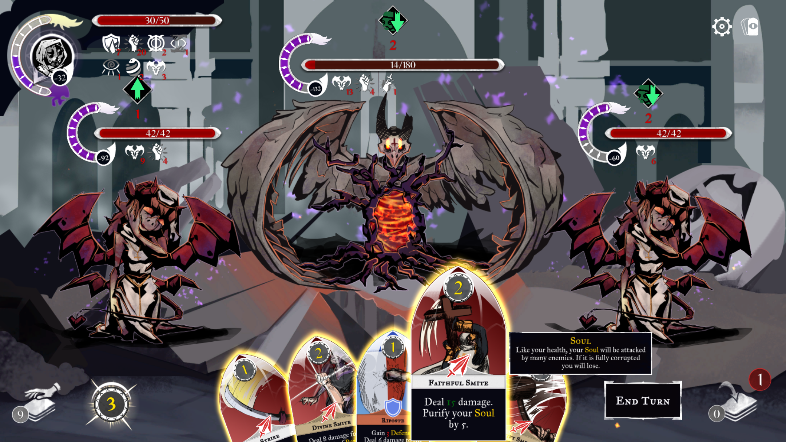

### Purify (Student Project)

Homepage: https://s4g.itch.io/purify

#### Roguelike deckbuilding card game

Purify is a Roguelike deckbuilding game, in which the players have to optimize their card deck.

#### Gameplay

- 48 different cards
- 13 different encounter
- 1 boss
- with seeed

[]

[Build Download](https://github.com/SradnickDev/Purify/blob/master/Build/Purify_GoldMaster_Build.rar)

### Documentation

  - [Technical Design Document](https://github.com/SradnickDev/Purify/blob/master/Documents/Purify TDD.pdf)

### Tools

  - [TortoiseSlackSlave](https://github.com/SradnickDev/Purify/tree/master/Tools/TortoiseSlackSlave)
	- TortoiseHg hook that posts in specific Slack channels about commits
