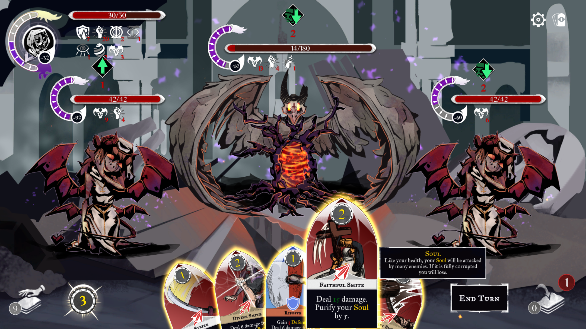

	
	

### Purify (Student Project)

Homepage: https://s4g.itch.io/purify

#### Roguelike deckbuilding card game

Purify is a Roguelike deckbuilding game, in which the players have to optimize their card deck.

#### Gameplay
- 48 different cards
- 13 different encounter
- Soul System
- modification of starter deck

#### Roles
- Gameplay and Editor Programmer , Tech Art

#### Engine / Languages
- Unity, C#

#### Responsiblities
- Implemented MessagePack for serialization process
- Used Extenject for dependecy injection
- Written different shader
- Created different Editor’s to extend game content easily
-  Developed simple to use Game Architecture

[Build Download](https://s4g.itch.io/purify)

### Documentation

  - [Technical Design Document](./docs/PurifyTDD.pdf)

### Tools

  - [TortoiseSlackSlave](./tools/TortoiseSlackSlave)
	- TortoiseHg hook that posts in specific Slack channels about commits
